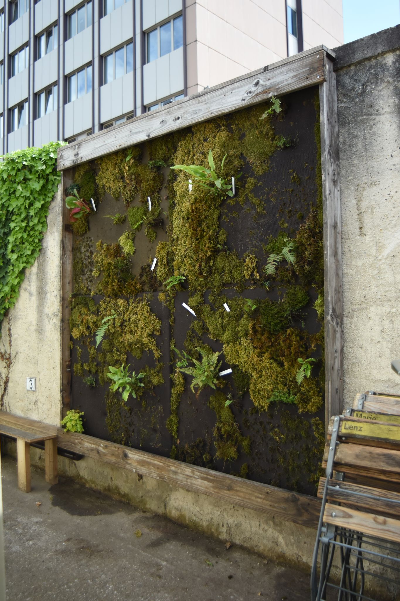

```{r, fig.fullwidth = TRUE, echo = FALSE}
knitr::include_graphics('assets/DSC_4309.JPG')
```


```{marginfigure}
Dipl. Biol. Kilian Lingen hat zu vegetationsökologische Renaturierungsmaßnahmen geforscht. Er arbeitete in den vergangenen vier Jahren hauptberuflich an der technischen Entwicklung und Umsetzung von Meerwasser-Aquaristik-Anlagen und der Haltung und Anzucht von Korallen. Neuerdings baut er auch beruflich vertikale Gärten. 
```
```{marginfigure}
Dr. Florian D. Schneider hat in Darmstadt zu komplexen ökologischen Netzwerken promoviert. Er unterrichtet an der TU Darmstadt im interdisziplinären Studienschwerpunkt Wissenschafts- und Technikforschung und forscht zu Fragen der kulturellen und ökologischen Bewertung von biologischer Vielfalt.   http://www.fdschneider.de;     Twitter: [f_d_schneider](https://twitter.com/f_d_schneider);     Instagram: [fdschn](https://www.instagram.com/fdschn/)
```

```{marginfigure}
Gemeinsam entwickeln sie vertikale Begrünungs-Konzepte zur Verbesserung von Luftqualität und Wohlbefinden. Die ökologisch-technischen Anwendungen basieren auf den Kreisläufen der Natur und funktionellen Aspekten der biologischen Vielfalt und erheben zugleich hohen Anspruch an Ästhetik und Raumempfinden. 

Nach einer Idee der Initiative Essbares Darmstadt.
```

# Warum vertikale Begrünung? 

Pflanzen filtern und binden Stickoxide, Feinstaub und andere Luftschadstoffe. Sie tragen auch zur Vermeidung der Ozonbildung im Sommer bei. Bei warmem und trockenem Wetter bieten Pflanzen Abkühlung und erneuert den Sauerstoff. Das Laubwerk von Pflanzen dient als natürlicher Lärmschutz. Vertikale Begrünungen an Fassaden und Wänden stellen ein vielversprechendes Konzept dar, um Grünanlagen außerhalb der Konkurrenz um Fläche zu realisieren. Die ökologischen Funktionen und Dienstleistung, die Pflanzen bereitstellen, können damit auch an stark verdichteten Orten in der Stadt genutzt werden. Vertikale Begrünung leistet als Nistplatz und Nahrungsquelle für Vögel und Insekten auch einen wichtigen Beitrag zur Biodiversität in der Stadt. 


# Warum Moose?

Moose bieten mit ihren feinen, dichten Blättchen eine große Oberfläche für eine maximale Anhaftung für Partikel aus der Luft. Moose nehmen Schadstoffe direkt über die Blattoberflächen auf und können sie so viel schneller abbauen und als Nährstoffe verwerten als Bäume und Stauden. Moose haben keine Wurzeln und viele Arten wachsen von Natur aus aufsitzend auf Steinen und Baumstämmen und sammeln ihre Nährstoffe aus dem abfließenden Regenwasser und direkt aus der Luft. Damit sind sie für vertikale Begrünung ideal geeignet. 


```{r, fig.fullwidth = FALSE, echo = FALSE, fig.align='center'}

```

# Was wird hier erprobt? 

Die vier Paneele haben unterschiedliche Aufbauten: mehrlagiges und einlagiges Textil, verschiedene Materialqualitäten, sowie eine Unterfütterung mit Schaumstoff als Wasserspeicher können hier verglichen werden. Zur Aufbringung der Moose wurden verschiedene Verfahren getestet: natürliches Anwachsen nach Anheftung in großen Stücken sowie Vermehrung durch Aufkleben von kleinen Bruchstücken und Fragmenten. Außerdem sind verschieden Moosarten aufgebracht, deren Wachstumsverhalten dokumentiert wird. Schließlich müssen der Rhythmus und die Wasserqualität der aktiven Bewässerung ebenfalls auf die Bedürfnisse der Moose abgestimmt werden. 


# Welche Moose sind hier zu finden?

In der Wand finden sich mindestens acht verschiedene Arten von Moosen, die sich in ihrer Wuchsform und ihren Eigenschaften unterscheiden. Flach anliegend und formenreich wächst das Zypressen-Schlafmoos (*Hypnum cupressiforme*) auf fast allen Oberflächen. Lockere Polster formt das purpurstielige Hornzahnmoos (*Ceratodon purpureus*). Das Geflecht des Kurzbüchsenmoos (*Brachythecium rutabulum*) bedeckt in der Natur sehr schnell und großflächig umgefallene Baumstämme. Das Etagenmoos (*Hylocomium splendens*) hat eine voluminöse Wuchsform mit vielen Verzweigungen. Diese Moosarten sind auch für ihre Schadstofftoleranz bekannt. Außerdem erproben wir weitere Moose, die wir aufsitzend auf Baumstämmen und Steinen gefunden haben.


```{r, fig.fullwidth = FALSE, echo = FALSE, fig.align='center'}
knitr::include_graphics('assets/Moose.png')
```

# Welche anderen Pflanzen wachsen in der Mooswand? 

Wir haben verschiedene Farne und Blütenpflanzen in der Mooswand eingesetzt. Deren Blattstruktur bietet zusätzlichen Schutz vor Verdunstung und kann bei Regen sogar Wasser sich auch in der Natur den Lebensraum mit Moosen an wechselfeuchten Felswänden und am Stammablauf von Bäumen. 

# Wo kann Moos zur Luftreinigung eingesetzt werden? 

Moos eignet sich im Innen- und Außenbereich zur Verbesserung der Luftqualität. Durch die flache Aufbautiefe können Moosmatten auch nah an der Schadstoffquelle, zum Beispiel an stark befahrenen Straßen, angebracht werden. Die Initiative Essbares Darmstadt hat den Vorschlag entwickelt, im Darmstädter Citytunnel mit Mooswänden zu experimentieren. Für Hauseigentümer bietet eine Fassadenbegrünung mit Moosen neben einer Verbesserung der Luftqualität auch eine zusätzliche Wärmedämmung des Gebäudes. Die Stadt Darmstadt fördert private Fassadenbegrünungen in manchen Stadtteilen auch finanziell. Auch in Büros oder Aufenthaltsräumen kann eine Mooswand trockene Luft oder Luftschadstoffe bekämpfen.

# Was sind die technischen Voraussetzungen für eine Mooswand?


```{marginfigure}
Alle Fotos und Texte © Kilian Lingen & Florian D. Schneider; für Anfragen zu Konzepterstellungen, Beratung und weitere Informationen: [e-mail](mailto:florian.dirk.schneider@gmail.com); Diese Projektseite ist Bestandteil der übergeordneten Webseite http://fdschneider.de.
```


Auch wenn Moose lange anhaltende Trockenheit gut überdauern können, ist eine aktive Bewässerung an den meisten Standorten für das Wachstum unerlässlich. Auch ohne Wasseranschluss ist das mit Rückführung des Abwassers und zusätzlicher Regenwassergewinnung lösbar. Im Winter muss die Anlage bei Frost abgeschaltet werden. Die Moose bekommen dann ohnehin genügend Feuchtigkeit aus der Luft. Im Innenbereich oder an überdachten Flächen kann eine künstliche Beleuchtung mit sparsamen LEDs nötig sein. In geschlossenen Räumen erhöht eine Mooswand die Luftfeuchtigkeit und muss an die Raumgröße und Belüftung angepasst sein. 


```{marginfigure}
<a href="https://www.openstreetmap.org/?mlat=49.87127&amp;mlon=8.63154#map=18/49.87127/8.63154">Größere Karte anzeigen</a>
```

<p>
<iframe width="950" height="700" frameborder="0" scrolling="no" marginheight="0" marginwidth="0" src="https://www.openstreetmap.org/export/embed.html?bbox=8.628001213073732%2C49.86950467916152%2C8.635082244873049%2C49.87304160479468&amp;layer=mapnik&amp;marker=49.87127144565303%2C8.631541728973389" style="border: 0px solid black; ; max-width: 100%;">
</iframe>
</p>
